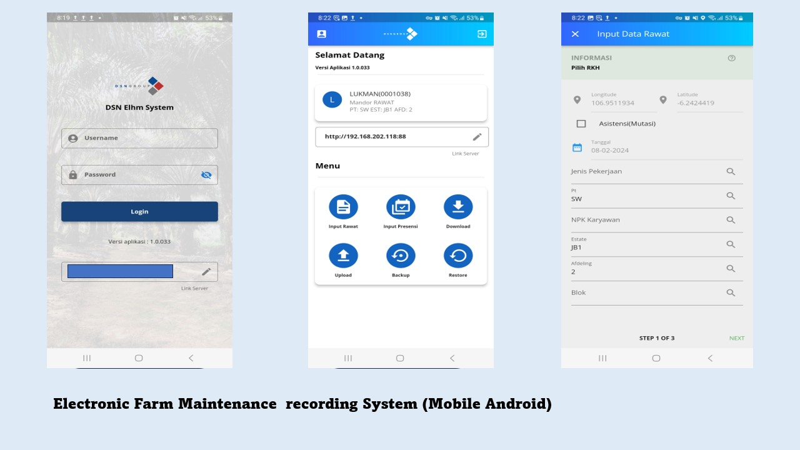

    
<!--        -->

<h1 align="center">
  
</h1>
   
###    About Me:

  Hi, I'm Yoga Pratama, Computer Engineer & Software Developer from INDONESIA  
   
   
  👨‍🎓 I'm currently working on PT Dharma Satya Nusantara(TBK) as an IT Application Developer Specialist
   
  📫 How to reach me 👇

  

<h2 align="center">🔥 Languages & Frameworks & Tools & Abilities 🔥</h2> 

  
  
  
  
  
  
  
  
  
  
  
  
  
  
  
  
  

<h2 align="center">⚡ Stats ⚡</h2>
 

 
<h2 align="center">🔥 Here Some of my Portofolio 🔥</h2> 

    <video width="630" height="300" src="https://github.com/yoga-pratama/yoga-pratama.github.io/assets/7127387/b5f35905-197e-4891-b371-0d75a2d49a8b"></video>

    
    
    
    
    

